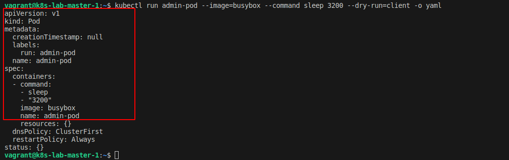
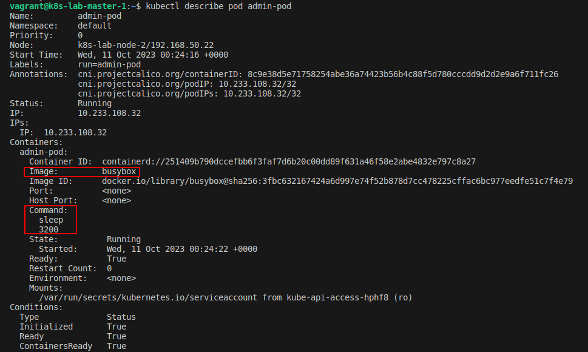

## Desafio 1

- Acessando o `Control PLane` [Master]
```bash
vagrant ssh master-01
```

<p align="center">
  
</p>

- Acessar o `yaml` de criação do pod
```bash
kubectl run admin-pod --image=busybox --command sleep 3200 --dry-run=client -o yaml
```

<p align="center">
  
</p>

- Criando o arquivo de criação do pod
- Adicionando `SYS_TIME` na lista de recursos

```bash
apiVersion: v1
kind: Pod
metadata:
  creationTimestamp: null
  labels:
    run: admin-pod
  name: admin-pod
spec:
  containers:
  - command:
    - sleep
    - "3200"
    image: busybox
    name: admin-pod
    securityContext:
      capabilities:
        add: ["SYS_TIME"]
```
- Adicionando o conteudo ao arquivo: `1-pod.yaml`
```bash
sudo vim 1-pod.yaml
```

- Criando o pod a partir do `1-pod.yaml`
```bash
kubectl apply -f 1-pod.yaml
```

- Describe pod admin-pod
```bash
kubectl describe pod admin-pod
```

<p align="center">
  
</p>