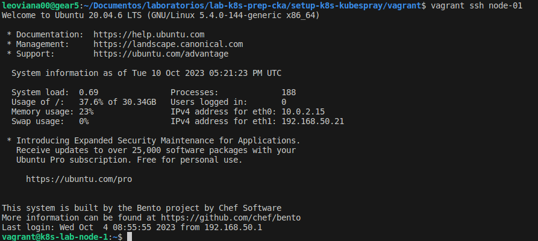
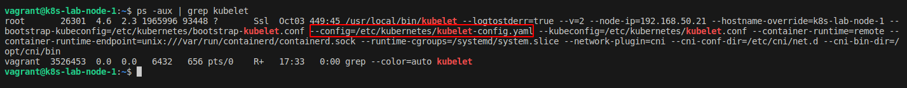
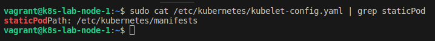
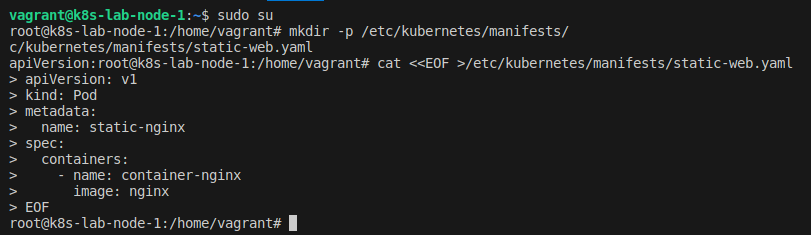
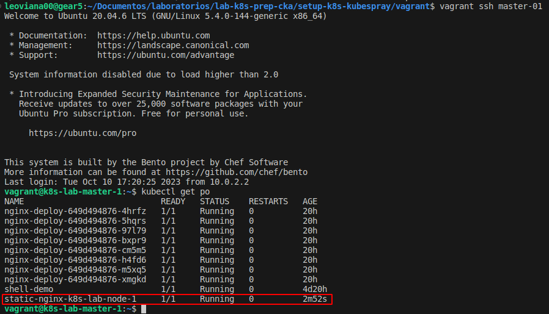

## Desafio 12

- Acessando o `Node 01` [Worker 1]
```bash
vagrant ssh node-01
```

<p align="center">
  
</p>

- Verificando o processo do `kubelet` no node e localizando sua configuração

```bash
ps -aux | grep kubelet
```

- Nesse caso o seu arquivo de configuração está neste path:
```bash
--config=/etc/kubernetes/kubelet-config.yaml
```

<p align="center">
  
</p>

- Localizando o `path` do StaticPod
```bash
sudo cat /etc/kubernetes/kubelet-config.yaml | grep staticPod
```

<p align="center">
  
</p>

- Craindo um staticPod

```bash
mkdir -p /etc/kubernetes/manifests/
cat <<EOF >/etc/kubernetes/manifests/static-web.yaml
apiVersion: v1
kind: Pod
metadata:
  name: static-nginx
spec:
  containers:
    - name: container-nginx
      image: nginx
EOF
```

<p align="center">
  
</p>

- Listando o pod

```bash
kubectl get po
```

<p align="center">
  
</p>

