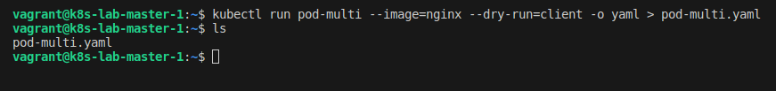
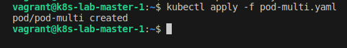
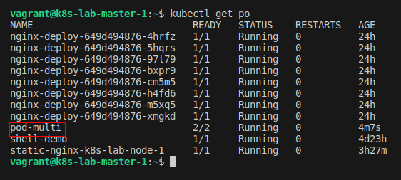
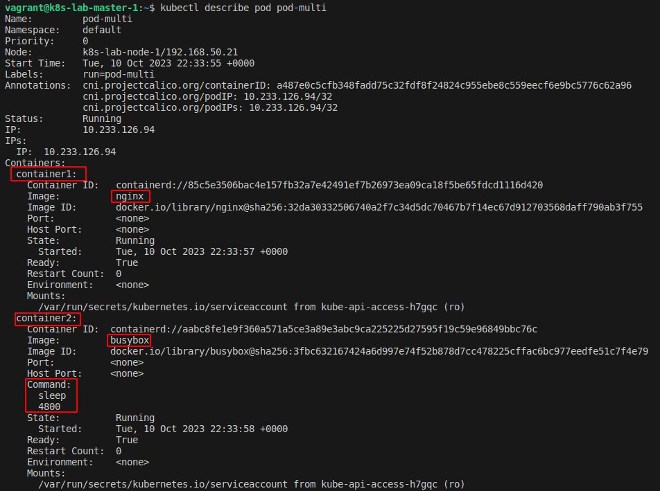

## Desafio 13

- Acessando o `Control PLane` [Master]
```bash
vagrant ssh master-01
```

<p align="center">
  
</p>

- Craindo um Pod Multicontainer

```bash
kubectl run pod-multi --image=nginx --dry-run=client -o yaml > pod-multi.yaml 
```

<p align="center">
  
</p>

- Ajustando o arquivo de criação do pod

```bash
sudo vim pod-multi.yaml
```
```bash
apiVersion: v1
kind: Pod
metadata:
  creationTimestamp: null
  labels:
    run: pod-multi
  name: pod-multi
spec:
  containers:
  - image: nginx
    name: container1
  - image: busybox
    name: container2
    command: ["sleep","4800"]
```

- Criando o pod multi-container

```bash
kubectl apply -f pod-multi.yaml 
```

<p align="center">
  
</p>

- Checando o pod

```bash
kubectl get po
```

<p align="center">
  
</p>

- Describe pod

```bash
kubectl describe pod pod-multi
```

<p align="center">
  
</p>