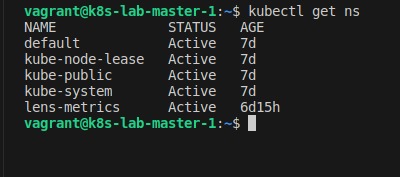
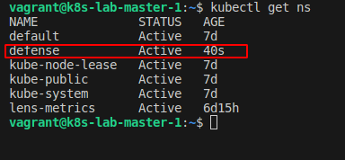
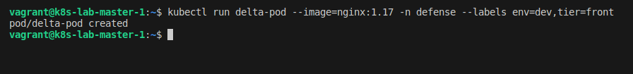
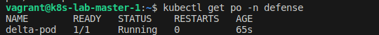
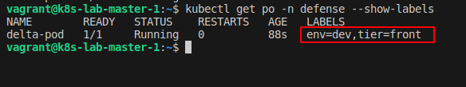
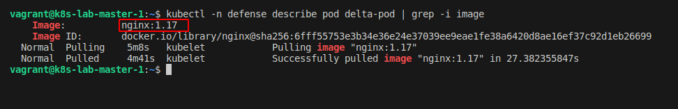

## Desafio 14

- Acessando o `Control PLane` [Master]
```bash
vagrant ssh master-01
```

<p align="center">
  
</p>

- Checando se o namespace `defense` existe
```bash
kubectl get ns
```

<p align="center">
  
</p>

- Criando o ns `defense`
```bash
kubectl create ns defense
```

<p align="center">
  
</p>

- Listando novamente os namespaces
```bash
kubectl get ns
```

<p align="center">
  
</p>

- Criando o `pod` de forma `imperativa`
```bash
kubectl run delta-pod --image=nginx:1.17 -n defense --labels env=dev,tier=front
```

<p align="center">
  
</p>

- Listando os pods do namespace `defense`
```bash
kubectl get po -n defense
```

<p align="center">
  
</p>

- Listando os pods do namespace `defense` mostrando as `labels`
```bash
kubectl get po -n defense --show-labels
```

<p align="center">
  
</p>

- Checando a imagem do pod
```bash
kubectl -n defense describe pod delta-pod | grep -i image
```

<p align="center">
  
</p>