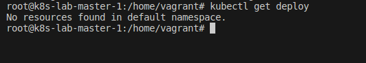
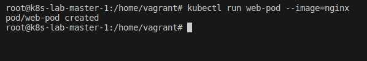
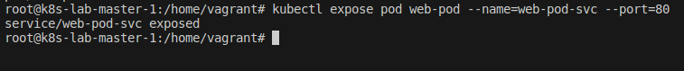
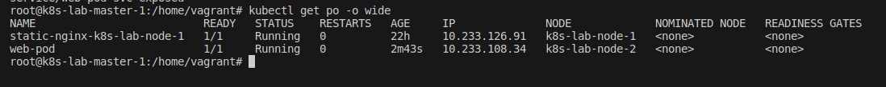
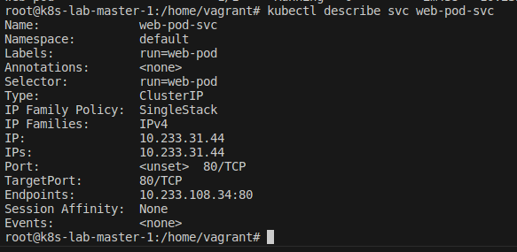
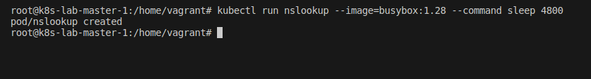
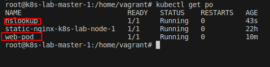
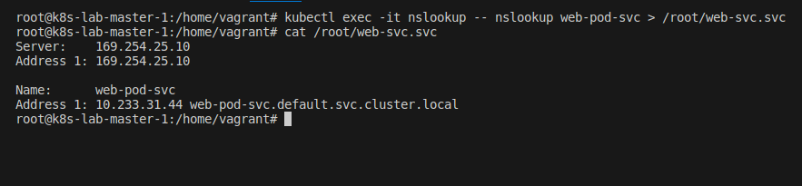
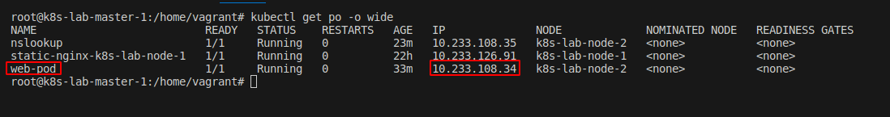
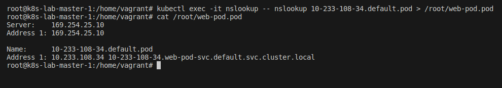

## Desafio 15

- Acessando o `Control PLane` [Master]
```bash
vagrant ssh master-01
```

<p align="center">
  
</p>

- Listando os pod
```bash
kubectl get pod
```

<p align="center">
  
</p>

- Listando deploy
```bash
kubectl get deploy
```

<p align="center">
  
</p>

- Criando um pod chamados `web-pod` com imagem `nginx`
```bash
kubectl run web-pod --image=nginx
```

<p align="center">
  
</p>

- Expondo o serviço `web-pod-svc`
```bash
kubectl expose pod web-pod --name=web-pod-svc --port=80
```

<p align="center">
  
</p>

- Checar o ip do pod
```bash
kubectl get po -o wide
```

<p align="center">
  
</p>

- Checabdo detalhes do service criado
```bash
kubectl describe svc web-pod-svc
```

<p align="center">
  
</p>

- Criando o pod `nslookup`
```bash
kubectl run nslookup --image=busybox:1.28 --command sleep 4800
```

<p align="center">
  
</p>

- Listando os pods novamente
```bash
kubectl get pod
```

<p align="center">
  
</p>


- Realizar uma pesquisa DNS e armazenar o resultado e, `/root/web-svc.svc`.
```bash
kubectl exec -it nslookup -- nslookup web-pod-svc > /root/web-svc.svc
cat /root/web-svc.svc
```

<p align="center">
  
</p>

- Pegando o ip do pod
```bash
kubectl get po -o wide
```

<p align="center">
  
</p>

- Resolvendo DNS direto para o IP do pod
```bash
kubectl exec -it nslookup -- nslookup 10-233-108-34.default.pod > /root/web-pod.pod

cat /root/web-pod.pod
```

<p align="center">
  
</p>
