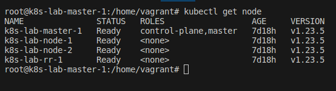
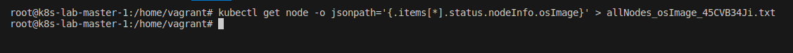
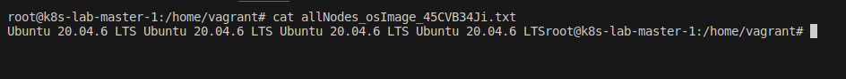

## Desafio 15

- Acessando o `Control PLane` [Master]
```bash
vagrant ssh master-01
```

<p align="center">
  
</p>

- Listando nodes
```bash
kubectl get nodes
```

<p align="center">
  
</p>

- Recuperando os osImages de todos os nós e armazená-los em um arquivo `allNodes_osImage_45CVB34Ji.txt`
```bash
kubectl get node -o jsonpath='{.items[*].status.nodeInfo.osImage}' > allNodes_osImage_45CVB34Ji.txt
```

<p align="center">
  
</p>

- Lendo o arquivo criado na raiz
```bash
cat allNodes_osImage_45CVB34Ji.txt 
```

<p align="center">
  
</p>
