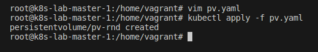
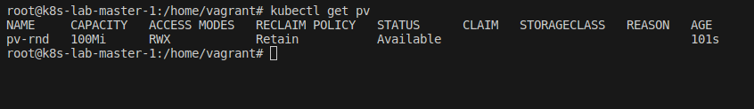
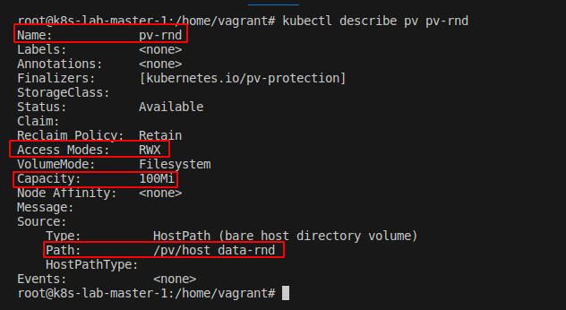

## Desafio 17

- Acessando o `Control PLane` [Master]
```bash
vagrant ssh master-01
```

<p align="center">
  
</p>

- Crie um arquivo chamado `pv.yaml` e copie o conteúdo
```bash
vim pv.yaml
```
```bash
apiVersion: v1
kind: PersistentVolume
metadata:
  name: pv-rnd
spec:
  capacity:
    storage: 100Mi
  accessModes:
    - ReadWriteMany
  hostPath:
      path: /pv/host_data-rnd
```

- Criando o pv apartir do `pv.yaml`
```bash
kubectl apply -f pv.yaml
```
<p align="center">
  
</p>

- Listando os volumes
```bash
kubectl get pv
```

<p align="center">
  
</p>


- Verificando os detalhes do `pv`
```bash
kubectl describe pv pv-rnd
```
<p align="center">
  
</p>

- Para essa questão não é preciso criar um pvc para claim, pois ele pediu somente o pv com umas especificações. O describe ajuda a confirmar se essas especificações foram atendidas.

- Caso fosse criar um `pv` e um `pvc`
- PV
```bash
apiVersion: v1
kind: PersistentVolume
metadata:
  name: pv-rnd
spec:
  capacity:
    storage: 100Mi
  accessModes:
    - ReadWriteMany
  hostPath:
      path: /pv/host_data-rnd
  claimRef:
      name: pvc-rnd
      namespace: default
```

- PVC
```bash
apiVersion: v1
kind: PersistentVolumeClaim
metadata:
  name: pvc-rnd
  namespace: default
spec:
  volumeName: pv-rnd
  accessModes:
    - ReadWriteMany
  resources:
    requests:
      storage: 100Mi
```
