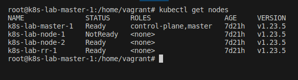
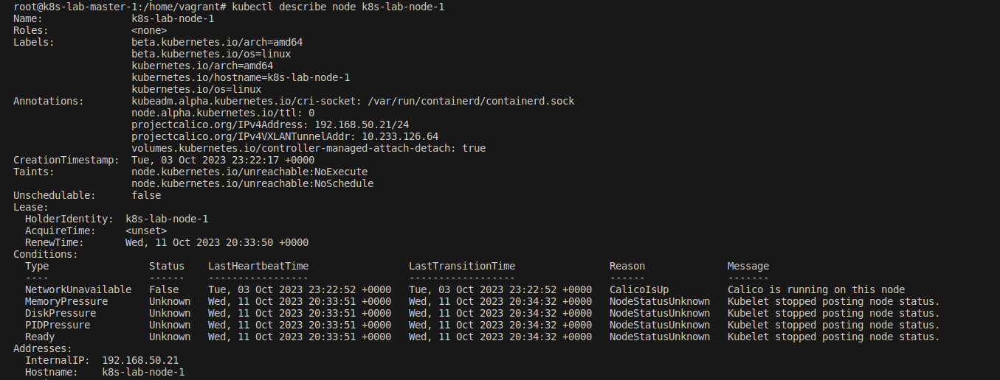
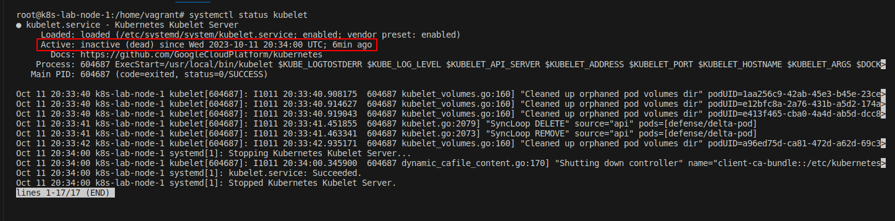
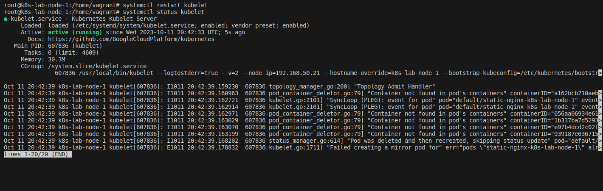
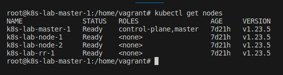

## Desafio 18

- NOTA:
    - Dê uma olhada e corrija os problemas.

    - A declaração do problema sugere que há um nó de trabalho do Kubernetes chamado Node One que não está respondendo.

    - Kubernetes é uma plataforma de orquestração de contêineres que automatiza a implantação, escalonamento e gerenciamento de aplicativos em contêineres no Kubernetes.

    - Worker Node é responsável por executar contêineres de aplicativos e se comunicar com o Kubernetes plano de controle.

    - O facto de o nó de trabalho não estar a responder implica que não é capaz de cumprir o seu dever de forma eficaz, o que poderia causar interrupções na implantação e nas operações de aplicativos em execução nesse nó.

    - A causa raiz dessa falta de resposta não é especificada, mas pode ser devido a vários motivos como conectividade de rede, problemas de erro de software ou falhas de hardware.

    - Esta tarefa exigia experiência em solução de problemas de administração do Kubernetes e administração de sistemas.

    - A pessoa pode precisar coletar informações de diagnóstico, como registros e métricas de desempenho, para identificar a causa raiz deste problema.

    - Com base na análise da causa raiz, a pessoa pode precisar aplicar ações corretivas, como reiniciar o nó, realocando recursos, atualizando software ou substituindo componentes de hardware.

    - No geral, a definição do problema é um apelo à ação para alguém que possui as habilidades e acesso necessários ao cluster Kubernetes para investigar e resolver os problemas com o nó de trabalho que não responde, para garantir a estabilidade e confiabilidade dos aplicativos em execução no cluster.


- Acessando o `Control PLane` [Master]
```bash
vagrant ssh master-01
```

<p align="center">
  
</p>

- 1 Passo: Checar o status do node
```bash
kubectl get nodes
```

<p align="center">
  
</p>


- Nota 1: `kubectl get node` para que você possa ver que o nó um não está respondendo no momento, portanto não está no estado, portanto pode haver algum problema ao iniciar o Kubelet ou o proxy Kube.

- Seja o que for, vamos investigar. Mas antes disso vamos dar um describe no node 1. Descreva o nó um para que só tenhamos que verificar se há algum erro nisso.
```bash
kubectl describe node node-01
```

<p align="center">
  
</p>

- Acessando diretamente o node
```bash
vagrant ssh node-01
```

<p align="center">
  
</p>

- Nota 2: E aqui temos que primeiro verificar o status do Kubelet, então systemctl e o status do kubelet.
```bash
systemctl status kubelet
```

<p align="center">
  
</p>


- Então aqui você pode ver que está no estado inativo. Vamos tentar reiniciá-lo e verificar o status novamente.
```bash
systemctl restart kubelet
systemctl status kubelet
```

<p align="center">
  
</p>

- Acessando o `master` novamente e verificando os nodes.
```bash
vagrant ssh master-01
sudo su
kubectl get nodes
```

<p align="center">
  
</p>

- Nessa situação reiniciando o serviço do `kubelet` no `node-01` foi o suficiente para restabelecer o funcionamento do node01.