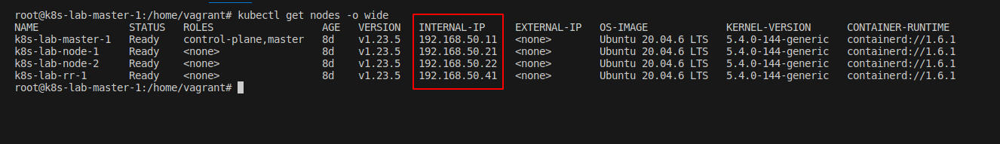
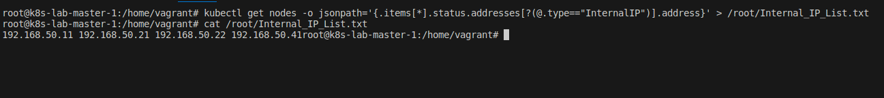

## Desafio 19

- Liste o IP interno de todos os nós do cluster e salve o resultado em um arquivo de lista de IP interno.

- As respostas devem estar no formato IP interno do primeiro espaço do nó.

- IP interno do segundo nó em linha única.

- A questão é pedir uma lista de endereços IP internos de todos os nós do cluster e depois salve o resultado no arquivo chamado lista de IPs internos.

- O endereço da lista IP interna é um endereço IP privado atribuído a cada nó do cluster, que é usado para comunicação intracluster.

- Essas informações podem ser obtidas usando vários comandos ou ferramentas, dependendo da configuração específica do cluster.

- Por exemplo, no cluster Kubernetes, o comando `kubectl get nodes -o wide` pode ser usado para listar o endereço IP interno de todos os nós.

- A saída do comando deve ser salva em um arquivo denominado lista de IPs internos usando um formato específico. O formato exigia que os endereços IP internos de cada nó fossem separados por um espaço, e todos eles para ser escrito em um único arquivo.

- Por exemplo, se o cluster tiver três nós com endereço IP interno.

```console
192.168.1.1192.168.1.2.

E 192.168.1.3.
```
- A saída deve ser todo o IP com separação de espaços salvando a saída em um arquivo.

- Ele pode ser facilmente compartilhado com outras pessoas ou usado para análises adicionais ou para fins de script.

- Em geral, todas as questões exigem que a pessoa tenha conhecimento da configuração específica do cluster e o comando ou ferramentas usadas para obter o endereço IP interno do nó.

- Também requer a capacidade de redirecionar a saída para um arquivo e formatar a saída de acordo com o especificado.

## Solução

- Acessando o `Control PLane` [Master]
```bash
vagrant ssh master-01
```

<p align="center">
  
</p>

- Verificando os nodes com a opção `wide`;
```
kubectl get nodes -o wide
```

<p align="center">
  
</p>

- Pesquisando na documentação: https://kubernetes.io/pt-br/docs/reference/kubectl/cheatsheet/

<p align="center">
  
</p>

- Vou pegar essa consulta que tem o objetivo de pegar os ExternalIPs e modificar para pegar os InternalIPs:
```bash
kubectl get nodes -o jsonpath='{.items[*].status.addresses[?(@.type=="ExternalIP")].address}'
```

- Ajustando para o nosso objetivo:
```bash
kubectl get nodes -o jsonpath='{.items[*].status.addresses[?(@.type=="InternalIP")].address}' > /root/Internal_IP_List.txt
```

<p align="center">
  
</p>