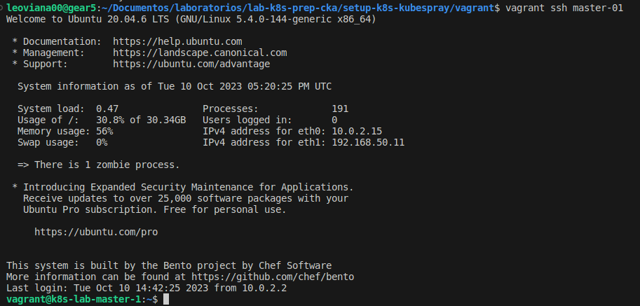
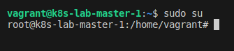
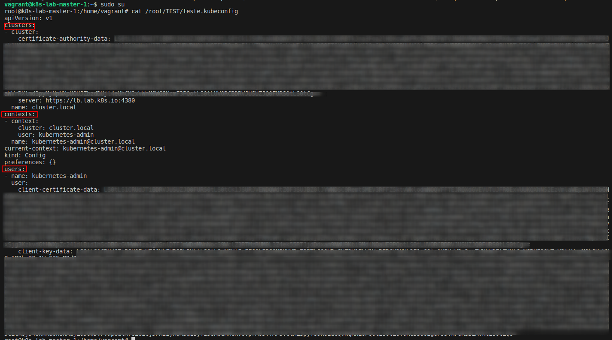
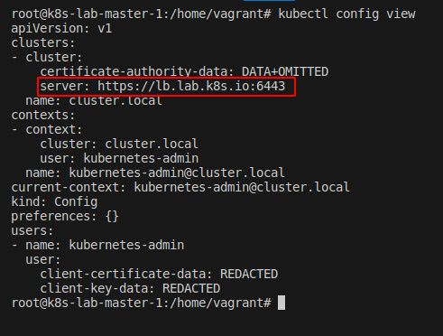
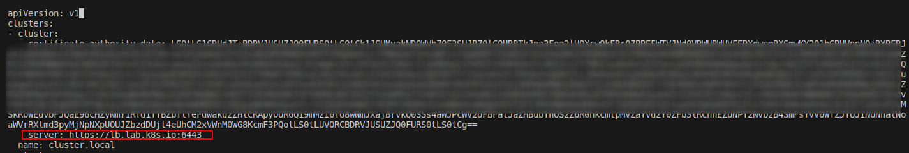

## Desafio 2

- Acessando o `Control PLane` [Master]
```bash
vagrant ssh master-01
```

<p align="center">
  
</p>

- Entrando como `root`
```bash
sudo su
```

<p align="center">
  
</p>

- Verificando o `test.kubeconfig`
```bash
cat /root/TEST/teste.kubeconfig
```

<p align="center">
  
</p>

- Verificando as configurações 
```bash
kubectl config view
```
<p align="center">
  
</p>

- Comparando com o `teste.kubeconfig` é possível ver uma diferença na porta do server
- Config view
```bash
server: https://lb.lab.k8s.io:6443
```

- teste.kubeconfig
```bash
server: https://lb.lab.k8s.io:4380
```

- A porta configurada no `teste.kubeconfig está errada`
- Acessar o arquivo de configurações e corrigir

```bash
vim /root/TEST/teste.kubeconfig 
```
<p align="center">
  
</p>