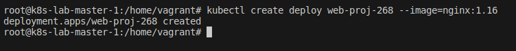
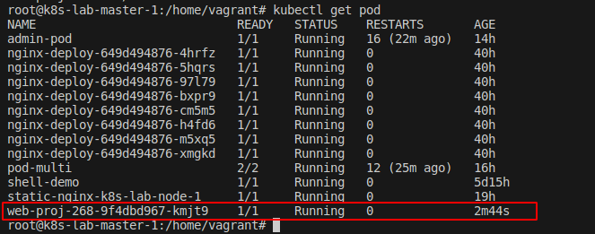
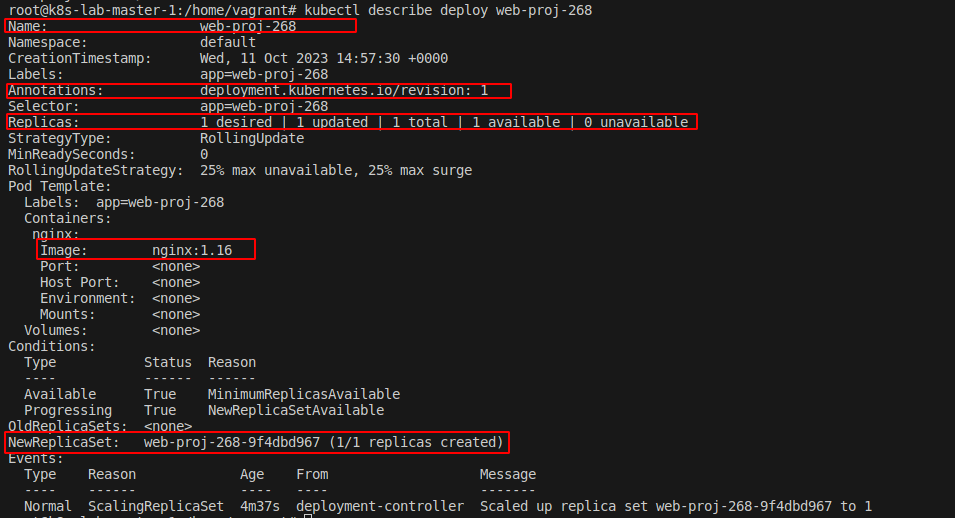
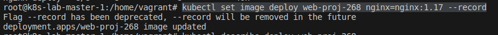
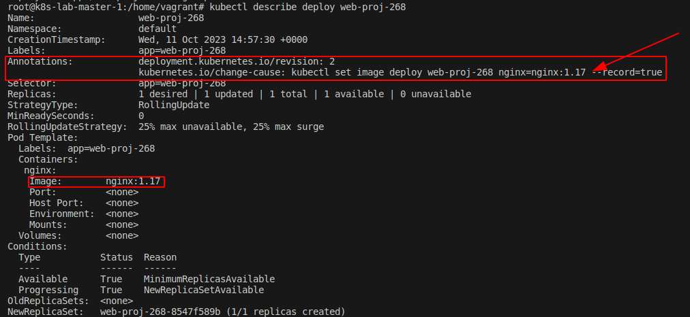
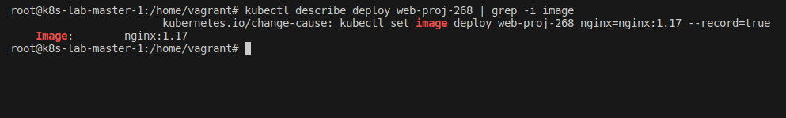
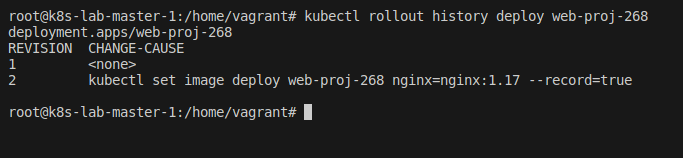
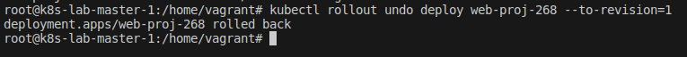
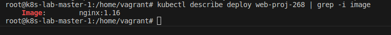

## Desafio 3

- Acessando o `Control PLane` [Master]
```bash
vagrant ssh master-01
```

<p align="center">
  
</p>

- Entrando como `root`
```bash
sudo su
```

<p align="center">
  
</p>

- Criando o deployment
```bash
kubectl create deploy web-proj-268 --image=nginx:1.16 
```

<p align="center">
  
</p>

- Checando o deployment
```bash
kubectl get deploy
```

<p align="center">
  
</p>

- Checando o pod
```bash
kubectl get pod
```

<p align="center">
  
</p>

- Verificando detalhes do deploy
```bash
 kubectl describe deploy web-proj-268
```

<p align="center">
  
</p>

- Atualizando a imagem do deployment
```bash
kubectl set image deploy web-proj-268 nginx=nginx:1.17 --record
```

<p align="center">
  
</p>

- Verificando detalhes do deploy novamente
```bash
kubectl describe deploy web-proj-268
```

<p align="center">
  
</p>

```bash
kubectl describe deploy web-proj-268 | grep -i image
```

<p align="center">
  
</p>

- Verificando o histórico de deployments
```bash
kubectl rollout history deploy web-proj-268
```

<p align="center">
  
</p>

- Roll Back
```bash
kubectl rollout undo deploy web-proj-268 --to-revision=1
```

<p align="center">
  
</p>

- Verificar detalhes do deploy novamente para confirmar se a imagem voltou para a `tag: 1.16`
```bash
kubectl describe deploy web-proj-268 | grep -i image
```

<p align="center">
  
</p>