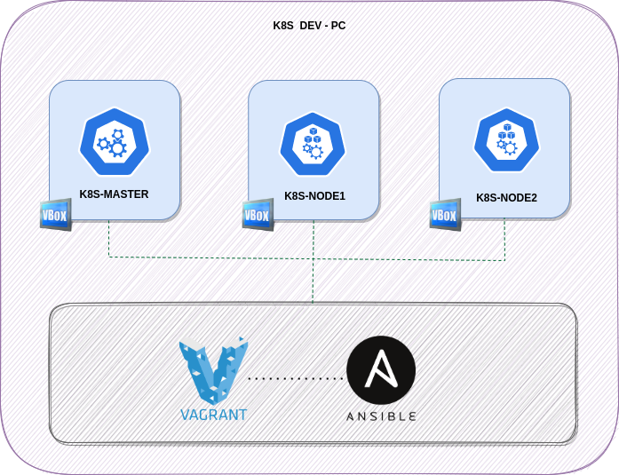
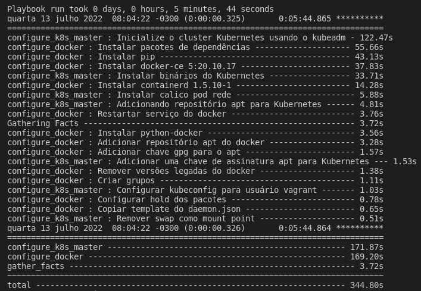

<h1 align="center">Setup Kubernetes </h1>

<p align="center">
  
  
  
</p>

<p align="center">
  
</p>

## 🌱 Project

- Criação de um setup kubernetes via `ansible`, `vagrant` e `virtualbox`.

## 🗒 Pré requisitos

- `vagrant`
- `ansible`
- `virtualbox`

## ✨ Ferramentas utilizadas

- Vagrant
- Ansible
- Kubernetes
- Virtualbox
- VsCode

## 🚀 Execução

1. Instalar pré-requisitos

```bash
make requirements
```

- OBS: Você pode enfrentar problemas com o vagrant para criar redes privadas. Significa que o Vagrant não poderá criar uma rede diferente da série 198.
- Para resolver o problema edite ou caso não tenha crie o arquivo de configuração `/etc/vbox/networks.conf` e adicione o seguinte:

```console
* 0.0.0.0/0 ::/0
```

2. Subir ambiente

```bash
vagrant up
```

<p align="center">
  
</p>

3. Para ambiente

```bash
vagrant halt
```

4. Remover ambiente

```bash
vagrant destroy -f
```

## 📄 Licença
Esse projeto está sob a licença MIT. Veja o arquivo [LICENSE](LICENSE) para mais detalhes.